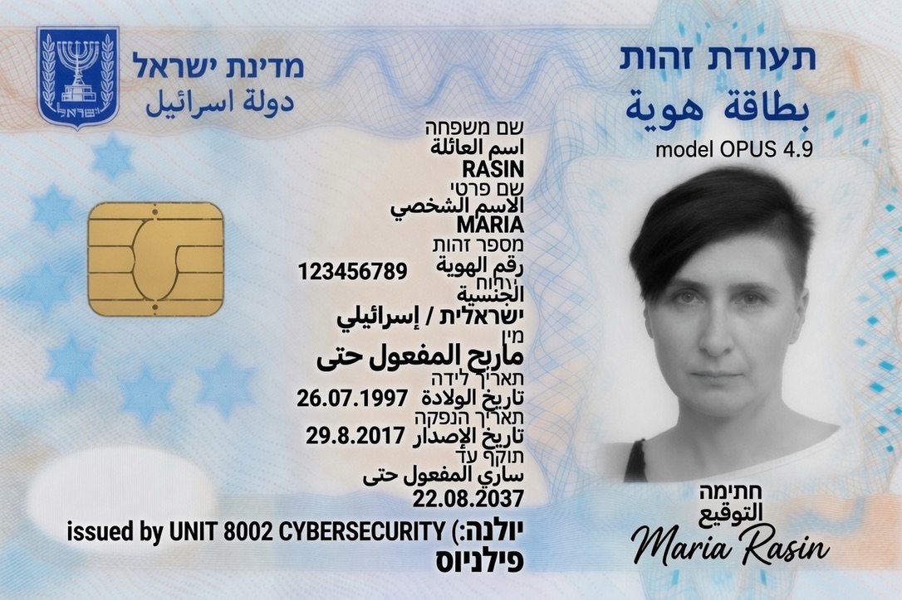
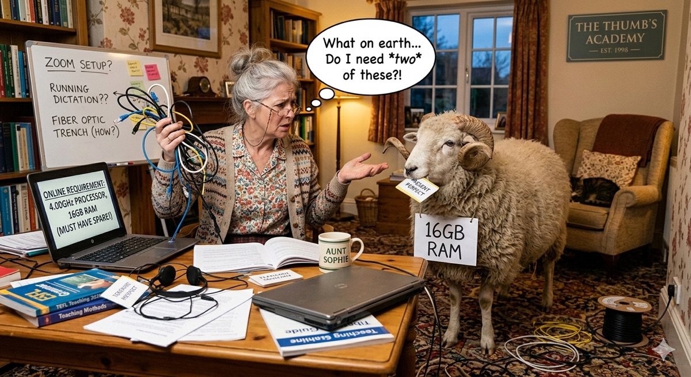

# Wing C — Museum of Broken Pedagogy / TEFL Wall of Fame  
### *Sister institution of Maria Rasin (TEFL lane)*

**Accession series:** `MUSEUM-2026-08-11-C-*`  
**Primary author of this wing’s artefacts:** **Maria Rasin**  
**Related plaque (iCloud source):**  
`Wall of Fame The Great TEFL Heist_from TEFL Diploma Assignment Continuation.md`  
**Date of legend:** 26 February 2026 · Gdańsk Digital War Room  

---

## NOTICE — What these images are

| Item | Nature |
|------|--------|
| Israeli-style teudat zehut **layout** with **MARIA / RASIN** | **Parody / generative art** for museum wall — **not** a real identity document |
| Label `model OPUS 4.9` · `issued by UNIT 8002 CYBERSECURITY` | Fiction / satire stratum |
| Aunt Sophie + **16GB RAM** sheep + **PRESENT PERFECT** | TEFL × tech-requirements comedy visual |

**Do not** use these files as ID, KYC, travel, or legal identity.  
**Do** hang them in the gift shop of broken pedagogy.

---

## Exhibits

### C-001 — Credentialing Ceremony (Opus 4.9)

**Accession:** `MUSEUM-2026-08-11-C-001`  
**File:** `MARIA_RASIN_OPUS49_TEUDAT_ZEHUT_PARODY.jpg`  
**Taxonomy:** HLP · satire · TEFL authorship credential (ceremonial)

Wall plaque for **Maria Rasin** as author of the TEFL wing.  
Field jokes include grammar-stratum Arabic/Hebrew “present perfect” energy and cybersecurity unit issuance — pure museum metalanguage.

---

### C-002 — Aunt Sophie @ The Thumb’s Academy (est. 1998)

**Accession:** `MUSEUM-2026-08-11-C-002`  
**File:** `AUNT_SOPHIE_16GB_RAM_PRESENT_PERFECT.jpg`  
**Taxonomy:** FOS · TEFL LMS hardware absurdity · metalanguage livestock

Whiteboard: *ZOOM SETUP? / RUNNING DICTATION?? / FIBER OPTIC TRENCH (HOW?)*  
Laptop: *4.00 GHz PROCESSOR, 16GB RAM (MUST HAVE SPARE!)*  
Sheep: **16GB RAM** collar; badge **PRESENT PERFECT** in mouth.  
Mug: **AUNT SOPHIE**.

Same family as HighWire LaserWriter 8.4 and Mistral toaster: **requirements that became culture**.

---

## Cross-links (Great TEFL Heist — text plaque)

From the 4 AM Gdańsk manifesto (preserved off-repo in iCloud; summarized here for visitors):

| Exhibit name | One-line |
|--------------|----------|
| Clay Pot Strategy | Same content sold three times under three labels |
| Malevich White on White | Empty Peer Teaching + lonely purple `i` |
| 10 Kopek Gate | 100% pass quizzes from early 2010s |
| Rogue Intern (2022) | iPhone into the rack → Mural + hope |
| Arsenal | Cmd+Shift+4 · Show Answer backdoor · Ostap Bender |

**Status on plaque:** All 10 modules 100% · Module 8 quiz 8/8 · Museum conquered.

---

## Authorship

This wing’s git history should attribute **Maria Rasin** as author of the TEFL artefact commits.  
Museum operator / co-curator: Dr. S. M. Rasin (Mistral halls + HighWire wing).

---

*Exit through the gift shop: “16GB RAM — Present Perfect” enamel pin (always out of stock, simultaneously available).*
